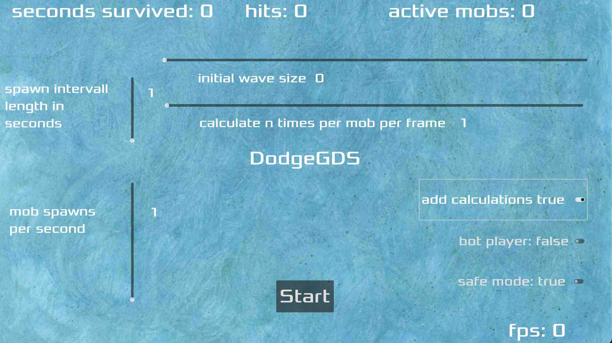

# DodgeGDS (gdext evaluation project)

This is part of a project to evaluate the godot-rust bindings [gdext](https://github.com/godot-rust/gdext).

It is derived from the game featured in the
["Your first 2D game"](https://docs.godotengine.org/en/latest/getting_started/first_2d_game/index.html)
tutorial in the godot documentation.

Language: GDScript

Renderer: Vulkan Mobile

The evaluation project consists of four Repositories:
- [overview repository](https://github.com/franziskusz/gdext-evaluation) (contains raw data, results and a description of the evaluation process)
- [this](https://github.com/franziskusz/dodge-gds)
- [Rust Version](https://github.com/franziskusz/dodge-r)
- [process-logger](https://github.com/franziskusz/process-logger)
- [python-pandas-plotter](https://github.com/franziskusz/pandas-plotter)

## Setup
- Installing [Support for the Vulkan Renderer](https://www.vulkan.org/tools#vulkan-gpu-resources) might be required.

If the [prebuild executables](https://github.com/franziskusz/dodge-gds/releases/tag/v0.1.0-alpha) [should not work for you](https://github.com/franziskusz/dodge-gds/issues/1), you can build the project from source with the following steps:
1. [Download Godot 4.2](https://godotengine.org/download/archive/4.2-stable/)
2. Clone this repository by opening a shell and entering:
   - `git clone git@github.com:franziskusz/dodge-gds.git` (requires having a ssh key setup)
   - or `git clone https://github.com/franziskusz/dodge-gds.git` 
4. Change to the just cloned repository directory with `cd dodge-gds` (Unix)
5. Open the `dodge-the-creeps/godot/project.godot` file by double clicking it.
6. With entering `command b` or clicking the triangle on the top right you can run the project within the editor in debug mode
7. In the menu select `Project -> Export...` to export
8. Select `Add..` at the top/center to add a `Preset` for your Operating System (This might require an additional autmatic download)
9. Select `Export Project` at the bottom and chose a name and target directory, deselect `Export With Debug` and click on `Save`

## Notes
- I am new to Godot and Rust. This whole project is also a learning experience for me. If the way some things are implemented gives you headaches, I apologize. I am open for any kind of criticism.
- The additional calculation workload is based on [godot-rust-benchmark](https://github.com/extrawurst/godot-rust-benchmark/tree/main)
- This applications writes performance logs to timestamped .csv files within the `/app_userdata/DodgeGDS/stats` directory. See [godot file paths](https://docs.godotengine.org/en/stable/tutorials/io/data_paths.html) for details. ***This directory will never get cleared automatically!***

## Screenshots

## Copying
`art/background`, `art/crab`, `art/creep1`, `art/creep2`, `art/creep3` Copyright &copy; 2024 [franziskusz](https://github.com/franziskusz), [CC BY-NC 4.0: Attribution-NonCommercial](https://creativecommons.org/licenses/by-nc/4.0/)

`art/House In a Forest Loop.ogg` Copyright &copy; 2012 [HorrorPen](https://opengameart.org/users/horrorpen), [CC-BY 3.0: Attribution](http://creativecommons.org/licenses/by/3.0/). Source: https://opengameart.org/content/loop-house-in-a-forest

Font is "Xolonium". Copyright &copy; 2011-2016 Severin Meyer <sev.ch@web.de>, with Reserved Font Name Xolonium, SIL open font license version 1.1. Details are in `fonts/LICENSE.txt`.
